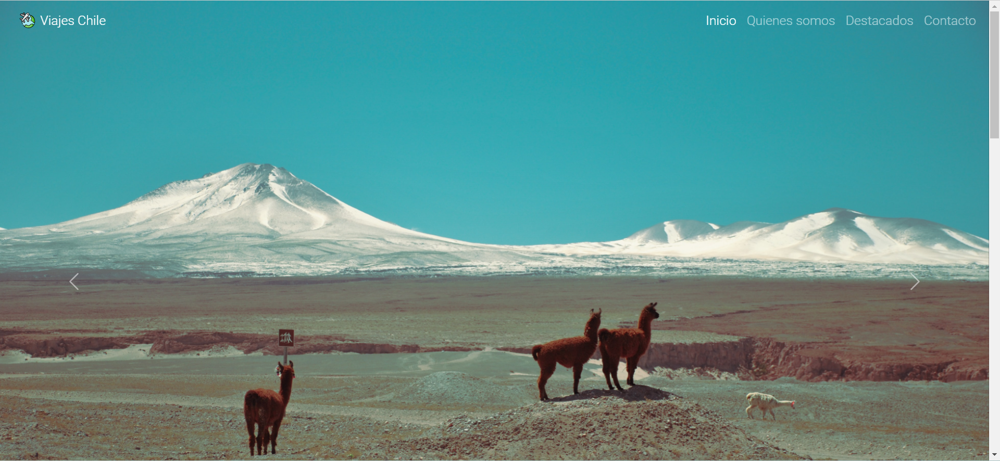
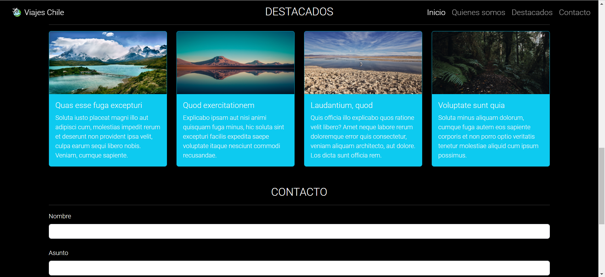
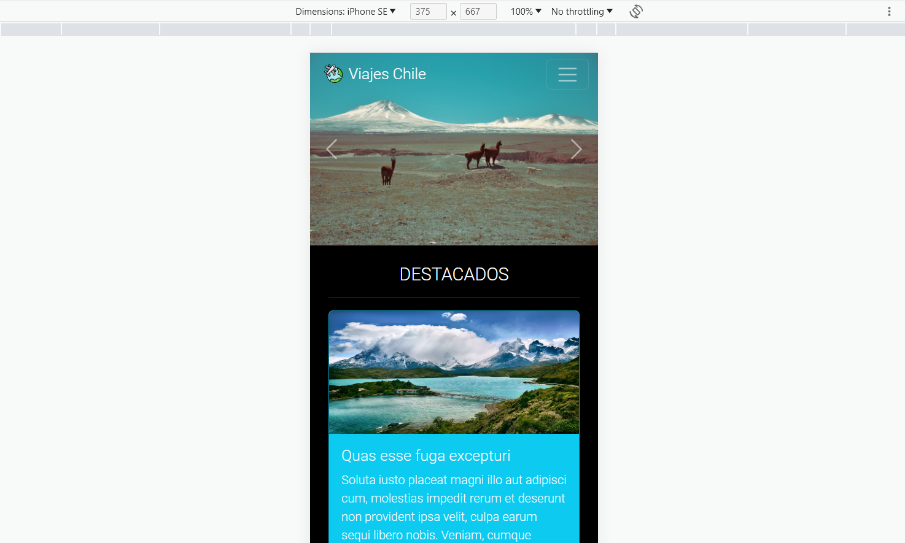

# Viajes Chile
Los mejores destinos para viajar por chile

## Table of Contents
1. [General Info](#description)
2. [Technologies](#technologies)
3. [Installation](#installation)
4. [Collaboration](#collaboration)
5. [FAQs](#faqs)

### Description
***
Proyecto realizado como prueba final del módulo 2 del bootcamp Desarrollo Ruby on Rails para Emprendimientos de Tipo Startup efectuado por Inforcap y Talento Digital para Chile, en la que se miden conocimientos en HTML, CSS, Javascript y frameworks de CSS como Bootstraps y Font Awesome.

### Screenshot del proyecto

## Technologies
***
Este proyecto fue construido con las siguientes herramientas:
* [HTML5] 
* [CSS3]
* [Javascript]
* [Bootstrap](https://getbootstrap.com/): Version 5.3
* [Font Awesome](https://fontawesome.com/): Version 6.4.2
* [Git] Version 2.41.0
